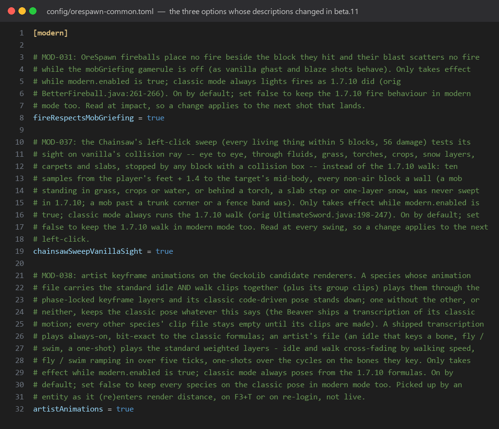
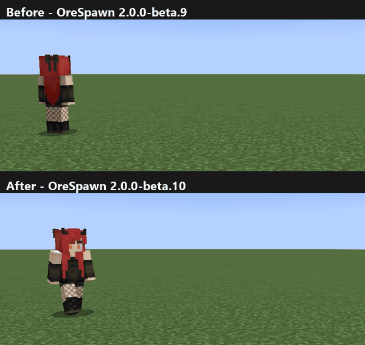

# OreSpawn for NeoForge 1.21.1 — Changelog

Newest first. Every version opens with what a player will notice, in plain words and, from beta.10 on, with pictures;
the technical detail, with the issue ids and the source lines, is folded under "Technical details" at the end of the
version. The full release notes for a cut live in `phase_g_reports/` and on the release page.

## 2.0.0-beta.11 — 2026-09-24 · [release page](https://github.com/CoolFreeze23/Orespawn/releases/tag/v1.21.1-2.0.0-beta.11) · [full notes](phase_g_reports/RELEASE_NOTES_2.0.0-beta.11.md)

A tidy-up release: the option descriptions in the config file read in plain words. Nothing in the game plays differently.

**Changed**
- Three option descriptions in `config/orespawn-common.toml` are rewritten in plain words: the fireball fire rule (`fireRespectsMobGriefing`), the Chainsaw's sight check (`chainsawSweepVanillaSight`) and the artist animations switch (`artistAnimations`).

*How the three options read in `config/orespawn-common.toml` from beta.11 on.*

**Good to know**
- Your settings stay as they are: the game rewrites only the descriptions in your existing config file, the first time it loads it.
- Works in the worlds you already have.

**Install:** put `orespawn-1.21.1-2.0.0-beta.11.jar` in `mods/` (NeoForge 21.1, Minecraft 1.21.1, GeckoLib 4.7 or newer) and take the beta.10 jar out. Worlds carry over.

Technical details

##### What beta.11 is

beta.11 is beta.10 with its text tidied: the three config descriptions above (MOD-031, MOD-037, MOD-038), the notes carried in the multi-part hit box profiles and the model data, and the comments in the source. No behaviour changes: the same 1,338 tests pass, and every model comparison and the benchmark verify against the same output as before.

##### How to install

Put `orespawn-1.21.1-2.0.0-beta.11.jar` into the `mods` folder of a NeoForge 21.1 instance for Minecraft 1.21.1 together with GeckoLib 4.7 or newer, and take the beta.10 jar out; MultiHitboxLib and Databuddy are bundled in the jar. Existing worlds and config files carry over.

## 2.0.0-beta.10 — 2026-09-24 · [release page](https://github.com/CoolFreeze23/Orespawn/releases/tag/v1.21.1-2.0.0-beta.10) · [full notes](phase_g_reports/RELEASE_NOTES_2.0.0-beta.10.md)

The Girlfriend and the Boyfriend fight properly again: they swing their arms when they strike, throw or dance, and they keep throwing shoes through a fight.

**Fixed**
- The Girlfriend and the Boyfriend keep throwing shoes at their target through the whole fight. Before, their first swing (a hit, a throw or a dance move) never finished, and they never threw again after it.
- Their arms swing again when they hit, throw a shoe or dance. That swing was never drawn before.

*Top, beta.9: one shoe, then she only watches. Bottom, beta.10: she keeps throwing, her arm swinging with each shoe.*

**Good to know**
- A hit that comes right after a throw lands without a second arm swing, the way every Minecraft mob's swing works.
- Works in the worlds you already have.

**Install:** put `orespawn-1.21.1-2.0.0-beta.10.jar` in `mods/` (NeoForge 21.1, Minecraft 1.21.1, GeckoLib 4.7 or newer) and take the beta.9 jar out. Worlds carry over.

Technical details

##### What beta.10 is

beta.10 is beta.9 plus one fix, ENT-S-175, the pair's swing timer, found while adding Better Combat attack animations for the pair in the OreSpawn Integrations companion mod. Nothing else moves; it applies to worlds you already have.

##### What changed

- **The pair's swing timer.** 1.21.1 advances a living entity's swing timer (`LivingEntity.updateSwingTime`) only from `Monster.aiStep`, `Player.serverAiStep` and the client's `RemotePlayer.aiStep`. The Girlfriend and the Boyfriend are `TamableAnimal`s, and the original ticks the swing itself at the head of `onLivingUpdate` (orig Girlfriend.java:577, Boyfriend.java:496). Without that call `swinging` stayed true and `swingTime` stayed at -1 after their first swing on both sides, so `attackAnim` never moved and `performRangedAttack`'s `swinging` guard (orig Girlfriend.java:977, Boyfriend.java:876) refused every later throw. Both `aiStep`s now call `updateSwingTime()` first, before `super.aiStep()`. Six gametests (`PairSwingTests` s175a-f) pin one step a tick and the end on the seventh update, a throw once a swing has ended, and the guard mid-swing. Every OreSpawn class whose 1.7.10 base ticked the swing (54, through `EntityMob`) is a `Monster` in the port; the pair were the only ones left without it.

##### How to install

Put `orespawn-1.21.1-2.0.0-beta.10.jar` into the `mods` folder of a NeoForge 21.1 instance for Minecraft 1.21.1 together with GeckoLib 4.7 or newer, and take the beta.9 jar out; MultiHitboxLib and Databuddy are bundled in the jar. Existing worlds carry over.

## 2.0.0-beta.9 — 2026-09-23 · [release page](https://github.com/CoolFreeze23/Orespawn/releases/tag/v1.21.1-2.0.0-beta.9) · [full notes](phase_g_reports/RELEASE_NOTES_2.0.0-beta.9.md)

Every OreSpawn creature now has hit boxes that follow its model, and the work those boxes add is kept small for the server and for multiplayer.

**Fixed**
- Hits land where a creature is drawn. A long or winged creature has several boxes along its body, neck, legs, tail and wings; a small one has one box its own size. Before, every creature but the bosses had a single box that did not match its model: a 6-block Alosaurus in a box under 2 blocks wide, a 13-block Basilisk in one under 2.
- A Crab or a Nightmare no longer starts out inside a box the wrong size. A freshly summoned Crab sat in a box four times its model until it grew.
- A flame arrow or a tipped arrow that hits one of a boss's hit boxes now sets the boss on fire or gives it the effect, and Punch knocks the boss back. In beta.8 those landed on the box and were lost.
- Pick-block and right-click items now work when you aim at one of a boss's hit boxes.
- Under PlayNicely, the boxes you aim at on a shrunken boss match its smaller size. In beta.8 they stayed full size on your screen.

**Changed**
- Every hit box takes full damage, as the single old box did. The old box is still what a creature walks and collides with, but it no longer takes hits itself.
- Mothra takes full damage wherever she is hit, as in the original. beta.8's hand-placed boxes took half on her body and a quarter on her wings.
- Babies, a growing Crab, a Nightmare's size and the Valentine's Girlfriend get boxes scaled like their models.
- The server now checks only the hit boxes of creatures near whatever it is testing, instead of every box in the world. In the densest test, 120 creatures packed together, each check got about seven times cheaper; creatures spread over a real world gain more.
- In multiplayer, the player who sends a creature's pose to the server sends it every second tick for ordinary creatures; bosses stay every tick. That halves the busiest player's upload. The other players no longer send empty updates the server ignored.

**Good to know**
- Boxes are square from above, so long thin parts read a little wider than they look. Wings and fins are padded for the flap rather than tilting with it.
- With no player nearby, a creature's boxes sit in its resting pose, still turned with its body.
- The boxes were fitted from the models, not judged in play. If a creature's boxes look wrong, tell us which one.
- Works in the worlds you already have.

**Install:** put `orespawn-1.21.1-2.0.0-beta.9.jar` in `mods/` (NeoForge 21.1, Minecraft 1.21.1, GeckoLib 4.7 or newer) and take the beta.8 jar out. Worlds carry over.

Technical details

##### What beta.9 is

beta.9 is beta.8 plus two changes: ENT-S-173, hit boxes that follow the rigs on every species, and ENT-S-174, the cost of those boxes taken down, so the extra boxes do not add lag. Nothing else moves. Both apply to worlds you already have.

##### What changed

- **Hit boxes that follow the rigs, every species.** The 103 living species drawn through a GeckoLib rig beyond the four bosses and the two robots carry MultiHitboxLib bone-synced profiles (666 parts; one box for 29 species, up to the adult Prince's 26) written from their rigs by `tools/hitbox_profiles.sh`: the species table from the registrations and every descriptor's render scale and transform, the writer's dump of each rig's drawn bones, `tools/hitbox_specs_from_rigs.py` grouping them into parts by geometry (touching bones merge while the union stays a compact square-footprint box the cubes fill, tiny bones fold into their neighbours, limb chains merge under the rig's cap, small creatures are one box, wings and fins padded for the flap; the adult Prince takes the King's grouping), and the batch write. Every part at full damage and not solid; no profile overrides the main size, so the registered box, a baby's half, the Crab's growth and Mothra's MOD-029 form stay the movement and collision box, unpickable and taking no damage itself. The part boxes follow the creature's size on both sides (the library's per-type `MHLibEntitySizeScales`, the port's `HitboxScales`); the server-side fallback places every box on its drawn rest segment, turned with the body (the profiles carry each part's rest rotation). A part stands for its creature where the game asks the entity itself (root vehicle, pick-block, fire, a right-click's item through `MixinPlayer`); a vanilla arrow's fire, potion effect, Punch and arrow count land on the creature through the new `MixinAbstractArrow`, its piercing lookup wrapped; the port's projectiles read the creature behind a hit part (`MyUtils.behindPart`). Mothra's hand-placed `OreSpawnPartEntity` layout and its head 1.0 / body 0.5 / wings 0.25 + 1 scheme retire. The Crab's and Pitch Black's cached boxes, stale from construction, are refreshed in their constructors. *(ENT-S-173; `HitboxProfileSweepTests` s173a-h)*
- **The cost of the boxes.** NeoForge walks every part entity of a level in both `Level.getEntities` box queries; the vendored library now keeps a per-level `PartEntityIndex`, one group per creature with an envelope of its parts' boxes, and `MixinLevel` hands NeoForge's loop only the parts of the creatures whose envelope meets the query box, exactly the flat walk's answer. The envelope is marked stale in `Entity.setBoundingBox`, the only writer of an entity's box, when a part's box really changes, and rebuilt before the next query; membership follows the level's part map through its tracking callbacks, put by put and remove by remove, and through the library's own client robot registration; a query off the level's thread, or any disagreement between the map and the index, walks the whole map as before. The generated profiles carry `bone-sync-interval: 2`, so the master client sends their bone poses every second tick (the four bosses keep every tick), and on a tick without a packet the server moves the last pose along with the creature; a client that is not the master sends only its first packet after a change of master, not an empty keepalive every 8 ticks. *(ENT-S-174; `PartIndexTests` s174a-g)*

##### How to install

Put `orespawn-1.21.1-2.0.0-beta.9.jar` into the `mods` folder of a NeoForge 21.1 instance for Minecraft 1.21.1 together with GeckoLib 4.7 or newer, and take the beta.8 jar out; MultiHitboxLib and Databuddy are bundled in the jar. Existing worlds carry over.

## 2.0.0-beta.8 — 2026-09-20 · [release page](https://github.com/CoolFreeze23/Orespawn/releases/tag/v1.21.1-2.0.0-beta.8) · [full notes](phase_g_reports/RELEASE_NOTES_2.0.0-beta.8.md)

Two fixes: `/kill` kills every OreSpawn creature again, and the King, the Kraken and Godzilla have hit boxes that follow their models.

**Fixed**
- `/kill @e` kills every OreSpawn creature, including the King, the Queen, Godzilla and the Kraken, and it works in the middle of a fight. Thirty creatures used to shrug the command off: some capped every hit, some ignored any hit for a second or two after the last one, and the boss heads passed it on to a body that capped it.
- The King's, the Kraken's and Godzilla's hit boxes sit on their models. The King's heads, necks, wings, legs and tail, the Kraken's head, body, fins and every tentacle, Godzilla's head, body, arms, legs and tail each have a box that follows the drawn part, the way the Queen's already did. The floating head boxes that never lined up with the models are gone.

**Changed**
- Hits on the King and Godzilla land by part, as on the Queen: heads take full damage, body, necks and legs half, wings and tail a quarter. The Kraken takes full damage anywhere, as it always did.
- Under PlayNicely the King, Godzilla and the Kraken now behave like the Queen: a small body box with small parts, hit through the parts.
- The Kraken no longer hurts or sets fire to itself with its own lightning.
- The King, the Queen and Godzilla no longer spawn the separate head creature from 1.7.10. One left in an old world disappears when it loads.

**Good to know**
- The big body box of each of the three (22 by 24 for the King, 4 by 15 for the Kraken, 9.9 by 25 for Godzilla) is still there as the collision box, but it no longer takes hits; the parts do. The parts are solid, so you can stand on Godzilla's tail.
- Long thin parts (necks, tentacles, wing membranes) read wider than they look, because part boxes are square in plan. The Kraken's tentacle boxes can lag the drawn tentacle by up to three blocks at the extremes of its wave.
- On a server with no player in render range the parts sit at their rest positions until someone comes close.
- Works in the worlds you already have.

**Install:** put `orespawn-1.21.1-2.0.0-beta.8.jar` in `mods/` (NeoForge 21.1, Minecraft 1.21.1, GeckoLib 4.7 or newer) and take the beta.7 jar out. Worlds carry over.

Technical details

##### What beta.8 is

beta.8 is beta.7 plus two fixes, both found in a play session on 2026-09-20: ENT-S-172, the `/kill` bypass, and BOSS-047, hit boxes that follow the rigs. Nothing else moves. Both apply to worlds you already have; a KingHead, QueenHead or GodzillaHead saved by an earlier build discards itself when its chunk loads.

##### What changed

- **`/kill` kills every OreSpawn entity.** `/kill` is `Entity.kill()`, for a living entity `hurt(genericKill, Float.MAX_VALUE)`, a source in the damage-type tag `bypasses_invulnerability` (with the void, the whole tag in 1.21.1), the tag vanilla's own gates yield to (the Invulnerable flag, the totem, the Wither's spawn armour; the Ender Dragon answers `/kill` in its own `kill()`). Thirty of the port's damage overrides, transcriptions of 1.7.10 `attackEntityFrom` bodies whose `/kill` could not name a mob, capped the amount (the King, the Queen and Godzilla at 750; the Boyfriend, the Girlfriend, the Purple Power, the Velocity Raptor, the Hydrolisc and the tamed Gazelle at 10), refused it inside their own hit window (twenty species, the King's 20 ticks to the Sea Viper's 5), forwarded it to a body that capped it (the three head sidecars) or, the hoverboard, refused an attacker-less hit while ridden. Each now opens with the clause: a bypassing source goes straight to `super.hurt`, before the window, the cap and the attacker tests; the heads take it and pass it to the body; the ridden board excepts it. Nothing else in any method moved. *(ENT-S-172; `KillBypassTests` s172a-c)*
- **Hit boxes that follow the rigs.** The King, the Kraken and Godzilla carry MultiHitboxLib bone-synced hitbox profiles (26, 25 and 16 parts) written from their rigs at the 1.7.10 render scales by `tools/boss_hitbox_profiles.sh`, the Queen's ENT-S-092 derivation generalised to multi-bone parts under any render scale and render transform: each box on its drawn segment, pivots through MHLib's own rotation, the King's thin wing tips padded for the flap. The King and Godzilla keep their damage scheme in the Queen's form (heads 1.0, body, necks and legs 0.5, wings and tail 0.25); the Kraken's parts are all 1.0. The 1.7.10 envelopes stay as unpickable collision boxes. The replaced-entity renderer applies the render scale after GeckoLib's capture and switches a profiled species' synched bones to matrix tracking first, so the collector ships the drawn positions from the first frame (the drawn image is unchanged). The hand-placed `OreSpawnPartEntity` layouts and the three sidecar spawns are removed; the sidecar types stay for old saves and discard themselves; the Queen's PlayNicely size hook covers any profiled species; the Kraken's own storm and burn are refused at `hurt` as the original never took them; the royal fireballs screen a part's boss. Declared: the square footprint of the aabb part type; the Kraken's tentacle boxes drifting up to three blocks at the wave extremes (the render transform is not folded into the shipped rotation); server-only fallback boxes; solid parts; the Kraken's 4x15 envelope held for a later decision. *(BOSS-047; `BossHitboxProfileTests` s047a-e, `HitboxPartTests`, `ConfigGateTests` boss017)*

##### How to install

Put `orespawn-1.21.1-2.0.0-beta.8.jar` into the `mods` folder of a NeoForge 21.1 instance for Minecraft 1.21.1 together with GeckoLib 4.7 or newer, and take the beta.7 jar out; MultiHitboxLib and Databuddy are bundled in the jar. Existing worlds carry over.

## 2.0.0-beta.7 — 2026-09-20 · [release page](https://github.com/CoolFreeze23/Orespawn/releases/tag/v1.21.1-2.0.0-beta.7) · [full notes](phase_g_reports/RELEASE_NOTES_2.0.0-beta.7.md)

One fix: creatures you leave behind despawn again, the way they did in 1.7.10. That ends the frog pile-up in Utopia that beta.6 had left in place.

**Fixed**
- Frogs, crickets and T-shirts no longer build up forever. Once you are more than 128 blocks away they despawn, as in the original; the ones near you stay.
- Hoverboards, Ant Robots, Spider Robots, the worms, the Purple Power, the Rock Base and the boss heads no longer vanish when you walk away from them.

**Changed**
- Wild, grown Baryonyx, Cassowary, Flounder, Stink Bug and Whale despawn when left behind. Their young stay for good.
- Wild adult Camarasaurus, Chipmunk and Water Dragon despawn when left behind. Tamed ones stay.
- A wild, unridden Prince (teen or adult) despawns when left behind. Tame or name-tag the ones you want to keep.
- Gold Fish despawn only at night. Pitch Black, Creeping Horror and Firefly only by day. The Lurking Terror only while it is not attacking.
- A baby Easter Bunny, Peacock, Lizard, Ostrich, Rubber Ducky or Velocity Raptor is kept for good once the game has checked on it, as the original kept it.

**Good to know**
- Works in the worlds you already have, chunk by chunk as they load.
- Nothing else changed in this build.

**Install:** put `orespawn-1.21.1-2.0.0-beta.7.jar` in `mods/` (NeoForge 21.1, Minecraft 1.21.1, GeckoLib 4.7 or newer) and take the beta.6 jar out. Worlds carry over.

Technical details

##### What beta.7 is

beta.7 is beta.6 plus one rule: creatures you leave behind despawn as they did in 1.7.10, which ends the frog pile-up in Utopia that beta.6's placement fix had left in place. Nothing else moves. It applies to creatures already in your world as their chunks load: the ones far from you go, the ones near you stay.

##### What changed

- **Left-behind creatures despawn as they did in 1.7.10.** Frogs, crickets and T-shirts never despawned in the port, so
  Utopia filled with every frog that ever spawned near you (2,753 in one eleven-minute session); beyond 128 blocks they
  despawn again, as in the original, and the ones near you stay. The same rule, transcribed from each original, now
  covers the wild, grown Baryonyx, Cassowary, Flounder, Stink Bug and Whale (their young stay), the wild adult
  Camarasaurus, Chipmunk and Water Dragon (tamed ones stay), and a wild, unridden Prince teen or adult. In the other
  direction the worms, the Ant and Spider Robots, the hoverboard, the Purple Power, the Rock Base and the boss heads no
  longer vanish when left behind. The Gold Fish despawns only by night; the Pitch Black, the Creeping Horror and the
  Firefly only by day; the Lurking Terror only while idle. A young Easter Bunny, Peacock, Lizard, Ostrich, Rubber Ducky
  or Velocity Raptor that meets the check is kept for good, as the original kept it. *(ENT-S-171)*

##### How to install

Put `orespawn-1.21.1-2.0.0-beta.7.jar` into the `mods` folder of a NeoForge 21.1 instance for Minecraft 1.21.1 together with GeckoLib 4.7 or newer, and take the beta.6 jar out; MultiHitboxLib and Databuddy are bundled in the jar. Existing worlds carry over.

## 2.0.0-beta.6 — 2026-09-20 · [release page](https://github.com/CoolFreeze23/Orespawn/releases/tag/v1.21.1-2.0.0-beta.6) · [full notes](phase_g_reports/RELEASE_NOTES_2.0.0-beta.6.md)

A hotfix for the three reports filed against beta.3: Utopia's trees, Utopia's frogs, and the hitbox report.

**Fixed**
- Utopia's Sky trees and Wind trees no longer lose their branches at chunk borders. The Sky trees stand at their original height again and every Wind tree leans east, as in 1.7.10.
- Utopia's giant square-trunked and round-trunked trees are back, with their spiral steps, platforms, chests and Iron Golems. The platform tree's branches are leaf-rimmed discs again instead of thin lines.
- Frogs no longer spawn on dry land all over Utopia. A frog from a water list needs two-deep water, as in 1.7.10; in rivers and swamps they spawn in the water and on the banks.

**Good to know**
- The tree and frog fixes apply to newly generated chunks. Chunks you already have keep their shape.
- The hitboxes in the report (Ender Knight, Hercules Beetle, Jumpy Bug, Hammerhead, Vortex) were already fixed in beta.5. The Basilisk's box was right all along.

**Install:** put `orespawn-1.21.1-2.0.0-beta.6.jar` in `mods/` (NeoForge 21.1, Minecraft 1.21.1, GeckoLib 4.7 or newer) and take the beta.5 jar out. Worlds carry over.

Technical details

##### What beta.6 is

beta.6 is beta.5 plus the fixes for the three player reports: Utopia's trees generate whole and complete again, Utopia's frogs stay in the water, and the hitbox report is answered. Nothing else moves. The worldgen fixes take effect in newly generated chunks; chunks generated before keep what they have.

##### What changed

- **Utopia's trees are whole again.** The Sky trees and the Wind trees generated with most of their branches missing: a
  tree that reaches past the next chunk had its outer blocks dropped by the game's chunk writer. They now generate as
  structures, written chunk by chunk, so every branch lands. With that the Sky trees stand at their 1.7.10 height again
  (their tops at the same level across the dimension, not a fixed height above the ground) and every Wind tree leans
  east, as in 1.7.10. *(WGEN-072)*
- **The big trees are back.** Utopia's giant square-trunked and round-trunked trees — the hollow towers with spiral
  steps, platforms, chests and Iron Golems on the branches — never generated in the port; only the rarer platform tree
  did, and that one's branches were lines where the original's are leaf-rimmed discs. All three generate now at the
  original's rates: one chunk in fifty rolls a big tree, one in four of those carries chests and golems, with the
  original's chest list. *(WGEN-073, WGEN-074)*
- **Frogs no longer flood Utopia.** The port let the every-tick water-creature spawn pass put frogs on dry land, and
  frogs never counted against that pass's cap. Frogs drawn from a water list now need two-deep water, as in 1.7.10; in
  rivers and swamps they spawn in the water and, as 1.7.10 also listed them there as land creatures, on the banks.
  *(ENT-S-170)*
- **Hitboxes (issue #3):** the Ender Knight, Hercules Beetle, Jumpy Bug, Hammerhead and Vortex boxes reported against
  beta.3 were restored to the originals in beta.5 (see that section); the Basilisk's was already right.

##### How to install

Put `orespawn-1.21.1-2.0.0-beta.6.jar` into the `mods` folder of a NeoForge 21.1 instance for Minecraft 1.21.1 together with GeckoLib 4.7 or newer, and take the beta.5 jar out; MultiHitboxLib and Databuddy are bundled in the jar. Existing worlds carry over.

## 2.0.0-beta.5 — 2026-09-19 · [release page](https://github.com/CoolFreeze23/Orespawn/releases/tag/v1.21.1-2.0.0-beta.5) · [full notes](phase_g_reports/RELEASE_NOTES_2.0.0-beta.5.md)

The GeckoLib rigs are now the default renderers for every creature except the two robots, and the parity work done since beta.4 ships with them: sizes, hitboxes, textures and targeting are the 1.7.10 original's again.

**Changed**
- Every creature except the Ant Robot and the Spider Robot now renders through a GeckoLib rig converted from its classic model and checked against it pixel for pixel. Nothing should look different. The Queen keeps her hand-made rig.
- One JVM argument puts a species back on its classic renderer for a side-by-side: `-Dorespawn.dev.classicRenderers=ender_knight` (a comma-separated list of registry names, or `classic` for everyone). The start-up log names what was kept classic.

**Fixed (since beta.4)**
- Mob sizes and shadows match 1.7.10 again: the Brutalfly nine times bigger, the Irukandji a quarter of its previous size, the Queen twice what the port drew, and a dozen others corrected.
- Sixty-three mobs have their 1.7.10 hitboxes back. Godzilla is 9.9 wide, Mothra's classic box is 5×2, and the Kraken has its Play Nicely mode.
- Textures on 97 models sit the right way round. The port had mirrored them, which showed on eyes, markings, text and blades.
- The Purple Power orb is a translucent, shimmering ball again, the Coin is visible, and the Crab shows all twenty-four legs and claws.
- OreSpawn's hunters target as they did in 1.7.10: the shared "leave it alone" list, the Peaceful and Play Nicely stand-downs, line of sight through grass and torches, prey lists, hunting ranges and grudges. Four modern targeting switches are on by default, each with one config line to turn it off.

**Good to know**
- The four butterflies share one rig. The Mothra's flat-wing pose differs from the classic drawing by 1.2 % of the image, and that was allowed on purpose.
- A few classic-renderer quirks are copied on purpose and recorded for the next parity pass: the Triffid's facing, Godzilla attacking on every cycle instead of about half, the Prince Teen's opaque wing membranes, the King's wing membranes on his classic renderer, and a Boyfriend or Girlfriend summoned with a negative age.
- The King, the Princess and Godzilla still use a single hitbox. Bone-synced hitbox parts for them are the next phase.
- Fairy Castle Trees in the Crystal dimension can still generate with sheared-off edges at chunk borders. That is the designated first post-beta patch.
- If a creature looks wrong, put it back on its classic renderer with the argument above and post a screenshot through each renderer, the species and the mod version at https://github.com/CoolFreeze23/Orespawn/issues.

**Install:** put `orespawn-1.21.1-2.0.0-beta.5.jar` in `mods/` (NeoForge 21.1, Minecraft 1.21.1, GeckoLib 4.7 or newer). MultiHitboxLib and Databuddy are bundled; the `-slim` jar is the library-less variant. Worlds carry forward from the earlier betas; 1.7.10 worlds are not upgradable.

Technical details

#### Part one — for the player

##### What beta.5 is

beta.5 is the build in which the GeckoLib rigs become the default renderers. Every creature but the two solver robots — the Ant Robot and the Spider Robot — now draws through a GeckoLib rig converted from its classic model and proven against it bone for bone and pixel for pixel; the poses are the classic motion, bit for bit; the Queen keeps her hand-made rig. Underneath the renderer change, the cycle's parity work stands in the same build: the creatures' sizes, shadows, hitboxes and textures, the hunters' targeting and a handful of restored models are the 1.7.10 original's again. And the game is ready for hand-made animations: when clips are delivered for a creature, it knows how to play them. (CHANGELOG.md, the beta.5 section; README.md, "2.0.0-beta.5 (this build)", the merge commit 8d7fd2d; phase_g_reports/ents092_changelog_note.md.)

##### What a default install sees

The rigs. With no argument and no config change, every landed rig draws through its GeckoLib renderer, posed exactly as the classic renderer posed it. The switch that puts a species on its rig is renderer registration, not a change to the creature, and none of the rig batches touched gameplay. Nothing should look different because of the renderer change: a rig that did not match its classic rendering at rest and at a posed sample, pixel for pixel within the comparison's rule, did not land. ( and "PHASE G — THE MERGE (2026-09-19)"; "PHASE G — THE FOURTH TIER-2 SLICE, T2d (2026-09-14)", "PHASE G — THE FIFTH TIER-2 SLICE, T2e (2026-09-15)", "PHASE G — THE SIXTH TIER-2 SLICE, T2f (2026-09-15)", "PHASE G — THE FK SLICE (2026-09-15)", "PHASE G — THE FK SLICE, SECOND ATTEMPT (2026-09-15)", "PHASE G — THE BUTTERFLY RIG (2026-09-19)"; "PHASE G — THE FIRST TIER-1 SLICE, T1a (2026-09-15)", "PHASE G — THE SECOND TIER-1 SLICE, T1b (2026-09-15)", "PHASE G — THE REMAINDER (2026-09-15)"; KNOWN_ISSUES.md, "The GeckoLib rigs — now the default renderers"; phase_g_reports/contact_sheets/index.md.)

What does look different from beta.4 is the parity work that went into the classic renderers first, in the weeks after beta.4 was cut — and the rigs draw exactly that. In short: mob sizes and shadows are the 1.7.10 registrations again (the Brutalfly nine times bigger; the Irukandji a quarter of its previous size, the Fairy 0.35×, the Robot 3 and the Cricket half, the Hydrolisc 0.65×, a dozen more at 0.75×; the Dragonfly and the Emperor Scorpion 1.5× bigger, the Prince Teen 1.47×; the Queen twice what the port drew, her hit parts on her bones); sixty-three mobs got their 1.7.10 hitboxes back (the Tshirt board 4×4, the Molenoid 3.9×2.6, the Emperor Scorpion 3.5×3, the Sea Monster's box down from 5×5 to 1.25×2.5, the ants, cricket, irukandji and rat small again), Godzilla is 9.9 wide, Mothra's box is 5×2 in classic, and the Kraken has its Play Nicely mode; textures on 97 models sit on their cubes the way the original drew them (the port had mirrored every face's texture on 89 mobs, the four butterflies and seven held items — visible on eyes, markings, text and blades); the Purple Power orb is a translucent, shimmering ball again; the Coin is visible; the Crab shows the twenty-four legs and claws the original drew; and OreSpawn's hunters target as they did in 1.7.10 — the shared "leave it alone" list, the Peaceful and Play Nicely stand-downs, line of sight through grass and torches, prey lists, hunting ranges, who gets picked first, when a grudge is let go — with four modern targeting switches on by default and one config line to turn each off. The full list, grouped, is in part two of the release notes. (phase_g_reports/ents092_changelog_note.md to "TARGETING WAVE 4 (2026-09-06)"; ENT-S-092, ENT-S-095, ENT-S-096, BUG-041, ENT-S-146, BUG-040, ANIM-025; the beta.4 version bump is commit 81549da of 2026-08-21.)

##### The switch, and its one-line escape per species

One JVM argument puts a species back on its classic renderer: `-Dorespawn.dev.classicRenderers=<registry names, comma-separated>` — for instance `-Dorespawn.dev.classicRenderers=ender_knight`, or `beaver,elevator` — and the exact token `classic` keeps every species on its classic renderer, for a side-by-side of the whole population. Registry names are trimmed and case-insensitive; the token `classic` is case-exact. The start-up log names each species kept classic, one line per exception at renderer registration; silence means every landed rig is drawing with its GeckoLib renderer. It is a JVM argument, not a config key; the earlier property `orespawn.dev.geckolibRenderers` is no longer read, so a stale one is inert. A species with no landed rig — the Ant Robot, the Spider Robot — never reaches the switch, and the Queen's native rig is untouched either way. (, the inverted switch's form; "PHASE G — THE MERGE (2026-09-19)", item 2; KNOWN_ISSUES.md, "The GeckoLib rigs — now the default renderers".)

What to report. If a species does look different — a limb on the other side, a part missing, a texture facing the wrong way — put it back on its classic renderer with the argument above and send the side-by-side: the species, the argument, a screenshot through each renderer, and the mod version, at https://github.com/CoolFreeze23/Orespawn/issues. That comparison is exactly the report this beta wants; for a crash, the log as well. (KNOWN_ISSUES.md, "The GeckoLib rigs — now the default renderers" and "Help us squash the rest"; README.md, "Reporting issues".)

##### Known issues

Condensed from KNOWN_ISSUES.md, which keeps the full list and its ids:

- **The four butterflies came last.** Butterfly, Luna Moth, Mothra and Vampire Butterfly share one rig; the Mothra's flat-wing pose ties 1.2 % of the image between two overlapping wing slabs, and the rig landed under a declared, pinned allowance for exactly that sample — the comparison's default rule of 1 % stands for everyone else. *(TEST-019)*
- **Classic-renderer quirks the GeckoLib rigs copy on purpose.** A converted rig draws exactly what the port's classic renderer draws; these are divergences of the classic renderer from 1.7.10, recorded and frozen for the parity pass to come, not fixed here: the Triffid stands a quarter-turn from where 1.7.10 turned it *(ENT-S-162)*; Godzilla bites and swings its arms on every cycle where 1.7.10 did so on about half of them, re-rolled per cycle *(ENT-S-163)*; the Prince Teen's wing membranes are opaque where 1.7.10 drew them translucent grey *(ENT-S-164)*. Two more are recorded beside them: put the King on his classic renderer and his wing membranes float 1.5 blocks above his wings — the GeckoLib rig, the default, draws them on the wings *(ENT-S-165)*; and a Boyfriend or Girlfriend summoned with a negative age draws as vanilla's big-headed baby on the classic renderer and as the adult rig at half size on the GeckoLib one, an edge no breeding reaches *(ENT-S-166)*.
- **Not started: boss hitbox profiles.** The King, the Princess and Godzilla keep the classic single hitbox; bone-synced hitbox parts for them are the phase after this one.
- **Unchanged from the earlier betas:** the visual and audio rough edges not yet hand-checked against 1.7.10 — some mob animations and model scales *(i043, i074)*, custom mob and boss sounds *(i048, i081, i087, i091, i104)*, the feel of the big mounts and the Left-Alt fly key *(i066, i068, i102)*, hoverboard tricks *(i070, i071, i072)*, boss-fight presentation *(i096, i098, i099, i103)*, the Princess's aura and the Krakens' mouth cycles *(i076, i093)*, far-dimension structures *(i124, i125, i128, i136, i162, i170)*, terrain and spawn sweeps *(i106–i120, i130, i144)*, the Village dimension on a live server *(i158, i164)*, the Valentine's Day Girlfriend *(i178)*; the Fairy Castle Trees of the Crystal dimension can still generate with sheared-off edges at chunk borders — the designated first post-beta patch *(BUG-021)*; and the 1.7.10 quirks that look like bugs but are the original's — the instant teen Prince, the twelve-minute Duplicator tree, the Chainsaw felling everything woody in an 11×16×11 box, the Instant Garden at your feet, rocks placing a pet rock, Mole dirt, the Experience armor's XP trickle, the Cephadrome that cannot be tamed for good *(TF-024, MOD-015 to MOD-019, i004, TF-032)*.

##### How to install

Drop `orespawn-1.21.1-2.0.0-beta.5.jar` into `mods/` of a NeoForge 21.1 instance for Minecraft 1.21.1, with GeckoLib 4.7 or later installed alongside; MultiHitboxLib and Databuddy are bundled inside the jar, and the `-slim` jar beside it is the library-less variant. Worlds carry forward from the earlier betas; 1.7.10 worlds are not upgradable. (README.md, "Installing"; `src/main/resources/META-INF/neoforge.mods.toml` — `neoforge` `[21.1,)`, `minecraft` `[1.21.1]`, `geckolib` `[4.7,)`, the second `[[mods]]` entry `multihitboxlib`; `META-INF/jarjar/databuddy-1.21-6.0.0.0.jar`; `build.gradle` lines 522–527, the jar classifiers; `gradle.properties`, GeckoLib 4.8.4 the build's own.)

## 2.0.0-beta.4 — 2026-08-21

The Chaos dimension gets its real terrain back: floating grassy islands drifting over open void.

**Fixed**
- Chaos is floating islands again, not a near-solid stone mass with a flat cap you arrived on top of.
- The islands have real hills, mountains, cliffs, overhangs and hanging pieces again.
- There is no sea. The original placed no fluid at all, so islands float over open void, End-style. There is no floor and no bedrock, so watch your step.
- Grass on every island, as in the original, with the grass-and-stone mix only in the Y60 to Y65 band.
- Safe arrivals: the teleporter now hunts for solid ground with headroom instead of dropping you at Y64 into the void. Butterfly and ant teleports both use it, and pets come along.
- The crumbly top and bottom layers of the world follow the original's per-layer dice.
- Beds work in Chaos again.

**Good to know**
- Chaos chunks you already generated keep their old shape. New areas, or a fresh visit after deleting the dimension's region files, show the fix.
- Mob spawns, features and carvers were already faithful and are unchanged.

Technical details

The Chaos dimension gets its real terrain back: floating grassy islands
drifting over open void. Worlds carry forward; already-generated Chaos
chunks keep their old shape, so ungenerated areas (or a fresh visit
after deleting the dimension's region files) show the fix.

#### The Chaos dimension — terrain restored

- **Floating islands, not a stone slab.** The 1.7.10 Chaos generator is
  a photographic negative of the Nether: it copies the Nether's noise
  field verbatim but flips the threshold — stone where the Nether has
  air, air where the Nether has rock
  (`ChunkProviderOreSpawn6.func_147419_a`: `if (d15 > 0.0) block =
  null`). The port had translated the noise math with the standard sign
  convention, which produced the inverse world: a near-solid stone mass
  with a flat sealed cap you arrived on top of. The router is now the
  faithful translation WITH the inversion: original noise scales
  (684.412 / 2053.236), the cosine banding, and edge falloffs that
  leave the top and bottom of the world fully open.
- **Hills and mountains restored.** Two unit-conversion errors verified
  against the decompiled modern engine (`BlendedNoise.java`): the
  legacy generator sampled noise per 4x8-block CELL while the modern
  `old_blended_noise` samples per BLOCK (so the scales must be 0.25 /
  0.375, exactly as vanilla's own port of the legacy Nether does in
  `nether/base_3d_noise.json` — the port had 1.0 / 3.0, making terrain
  4x too fine horizontally and 8x vertically), and the modern function
  divides its output by 128 (the port left the banding spline in legacy
  units, so the noise was ~128x too weak and the +/-2 cosine band —
  meant as a subtle bias against noise swinging +/-50 — dictated the
  whole shape as dead-flat plates). With both fixed, a side-by-side
  render of the original `initializeNoiseField` math and the port's
  router is numerically identical: rolling grass-topped highlands with
  real mountains, cliffs, overhangs and hanging islands
  (`tools/chaos_slice.py`).
- **No sea.** The original places no fluid at all — its Nether-inherited
  lava fill was deleted and the water branch is unreachable dead code.
  The port wrongly declared a water ocean below Y64, which under
  floating islands would have been an endless sea. Islands now float
  over open void, End-style; there is no floor and no bedrock, so watch
  your step.
- **Grass on every island.** Grass with dirt underneath is the
  original's default surface at any height; only inside the Y60-65 band
  does it thin into noise-driven grass/stone patches (roughly 3:1). The
  port had it backwards — grass confined to that band, bare stone
  everywhere else.
- **Safe arrivals.** The original teleporter hunts for a landing spot:
  scan the arrival column for ground with headroom, and when the column
  is pure void, wander to nearby columns until an island is found
  (`OreSpawnTeleporter.justPutMe` retry loop). The port scanned a
  single column and blind-dropped at Y64 — a void fall in the corrected
  terrain. The hunt is now ported; butterfly and ant teleports both use
  it, and pets still come along to the found spot.
- **The crumbly shell.** The original's block-by-block dither of the
  top and bottom five world layers is ported with its exact per-layer
  probabilities, so any stone crumbs near the build limits stay rugged
  instead of forming plates.
- **Beds work.** The original allowed respawning in Chaos; the ported
  dimension type wrongly said no.

Mob spawns, features (scraggly trees, anthills, veggie patches, ores),
and carvers were verified against the original `setChaosCreatures`
roster and chunk provider — all already faithful, unchanged.

## 2.0.0-beta.3 — [release page](https://github.com/CoolFreeze23/Orespawn/releases/tag/v1.21.1-2.0.0-beta.3)

A server-killing worldgen crash fixed, plus the close-out of the Queen animation review.

**Fixed**
- Generating a new chunk with a classic lake in the Village or Mining dimension could kill the whole server when Serene Seasons is installed. It no longer can.
- The Queen fights at full speed again. Her flight and attacks had been running at half the original's rate.
- Her wake-up animation plays out fully, only real hits wake her from the dormant blue phase, and two guards stop her from freezing mid-transition.

**Good to know**
- Ice placed during generation now follows the biome's base climate rather than the season on the day the chunk happened to generate.
- Worlds carry forward from any earlier beta.

Technical details

A server-killing worldgen crash fixed, plus the full close-out of the
Queen animation review. Worlds carry forward from any earlier beta.

#### World generation

- **Village/Mining dimension lake crash fixed.** Generating a new chunk
  with a classic lake could kill the whole server with
  `IllegalStateException: Requested chunk unavailable during world
  generation` when Serene Seasons is installed. Our lake feature already
  clamped its own biome lookups to the guaranteed worldgen region, but
  Serene Seasons redirects the freeze check *inside* vanilla's
  `Biome.shouldFreeze` to a seasonal hook that performs its own
  unclamped biome lookup — which can sample a chunk outside the region
  when a lake hugs a chunk corner. The freeze check is now inlined with
  all sampling on the clamped position, out of reach of the redirect.
  Generation-time ice now reflects the biome's base climate rather than
  the season on the day the chunk happened to generate (the saner
  behavior anyway).

#### The Queen — animation-review follow-ups

The held findings from the Queen animation review (the same pass that
fixed her mid-air freeze) are now closed out:

- **She fights at full speed again.** Her flight impulses and attack
  cadence were running at half the original's rate — the modern goal
  system only ticks a boss's behavior every other tick unless the goal
  opts into every-tick updates, which the 1.7.10 Queen effectively had.
- **Her wake-up plays out fully.** The dormant-to-aggro transition was
  being cut off 12 ticks before the animation's final pose.
- **Only real hits wake her.** Explosions (which heal her) and other
  filtered non-hits no longer flip her out of the dormant blue phase.
- **Two freeze-proofing guards.** The wake-up countdown can no longer
  stall permanently if her AI is interrupted mid-transition, and her
  stance controller can no longer latch off from a one-frame
  client-side death-state flicker.

## 2.0.0-beta.2 — [release page](https://github.com/CoolFreeze23/Orespawn/releases/tag/v1.21.1-2.0.0-beta.2)

A field-report patch: ants and termites as the original had them, and daylight back in the Mining dimension.

**Fixed**
- Ants and Red Ants no longer spawn naturally in every biome. They come from anthills, ambushes and eggs, as in the original, and they despawn again, so the swarms your world has already accumulated clear out as you play.
- Anthills look like the original's grassy mounds again instead of bare orange cubes.
- Ants are ant-sized again: quarter scale, with Red Ants and Termites at 0.35×.
- Termites multiply while eating your house again, with the original's ten-termite crowd cap.
- The Mining dimension has daylight and a day and night cycle again. Chunks explored before this fix may stay dark until the light engine touches them.

**Changed**
- One deliberate deviation: a nest skips its 2 to 7 ant burst once ten or more ants are already nearby, so idling next to an anthill cannot snowball into hundreds of ants.

Technical details

A field-report patch: everything in it came from walking around a real
modded world and asking "did the original actually do this?" Worlds
carry forward from any earlier beta.

#### The ant & termite overhaul

- **Ant armageddon fixed.** Ants and Red Ants were spawning naturally
  in every overworld biome at cow-level frequency — invented content;
  the original 1.7.10 registered natural spawns for 55 creatures and
  the ants were never among them. They come from anthills, ambushes,
  and eggs, exactly like the original. On top of that the port's ants
  were immortal: the original let them despawn like monsters, and
  that's restored — so the swarms your world has already accumulated
  will clear themselves out as you play.
- **Anthills no longer disguise themselves as copper blocks.** The
  red/rainbow/unstable nests rendered as bare orange cubes and the
  termite nest wore the Crystal-dimension texture by mistake. All five
  overworld nests use the original antnest look again, with the
  original's biome grass tint, so they sit in the landscape like the
  grassy mounds they always were.
- **Ants are ant-sized again.** The original rendered ants at quarter
  scale (Red Ants and Termites at 0.35×); the port lost the scale-down
  and drew them 4× too big, which also made the classic leg-scurry
  animation look broken. Original sizes and shadows restored.
- **Termites multiply while eating your house again** — the original's
  replication-on-eat (with its own 10-termite crowd cap) had been
  dropped in the port. Wood still turns to dirt or vanishes under
  mobGriefing, exactly per the original's dice.
- **One deliberate deviation, clearly labeled:** a nest block now skips
  its 2-7 ant burst once 10+ ants are already nearby, so idling next
  to an anthill can't snowball into hundreds of entities. The original
  relied on despawning alone; with modern render distances that still
  let populations pile up within despawn range.

#### Also in this build

- **The Mining dimension has daylight again.** The original's Mining
  dimension is an open-sky mountain world with a day/night cycle and
  sleepable beds; the port had declared it a skylight-less ceiling
  world at 0.1 ambient light, rendering it near-black. Chunks you
  explored before this fix were saved without skylight data and may
  stay dark until the light engine touches them (or you visit fresh
  terrain) — new chunks are properly sunlit.

## 2.0.0-beta.1 "OreSpawn Modernized" — [release page](https://github.com/CoolFreeze23/Orespawn/releases/tag/v1.21.1-2.0.0-beta.1)

The first 2.0 build. The 1.0 line replicated 1.7.10 exactly; 2.0 is where the deliberate improvements live, always one config line away from pure 1.7.10.

**Added**
- The Giant Robot Spider and the Robot Ant walk for real: their legs plant on the ground, find footing on stairs and ledges, and the body rides them. Every leg is hittable and deals body damage.
- The spider is rideable and steerable for the first time, with a riding camera that pulls back so the body sits low in view. Clicking a leg mounts you.
- `spiderMovement = "CLASSIC"` gives you the exact 1.7.10 robots. The test suite runs green in both modes on every build.

**Fixed**
- The Queen no longer freezes mid-air or repeats one attack swing after her first melee.
- Vanilla creepers no longer carry invisible extra hitboxes from a bundled library demo file.
- The Princess and the Prince no longer spawn wild. They come from spawn eggs, the Queen's death and structures, as in the original.
- Riders sit on the spider properly again, and the spider's body hitbox is the original's 3.25×2.25.

**Good to know**
- On laggy servers a mid-swing leg leads your view; hit the body, it pays the same.
- The legs' tempo at sustained sprint and the Robot Ant's step tempo are first-pass tunes. Reports welcome.
- Worlds carry forward from any 1.0 beta.

Technical details

The first public build of OreSpawn 2.0. The 1.0 line replicated 1.7.10
exactly; 2.0 is where the deliberate improvements live — clearly
labeled, and always one config line away from pure 1.7.10. Worlds
carry forward from any 1.0 beta.

#### The headline: the Procedural Spider Overhaul

- **The Giant Robot Spider and Robot Ant walk for real now.** With the
  default `spiderMovement = "MODERN"`, the legs are procedural and
  genuinely plant: feet stay put in the world while the body moves,
  find footing on stairs, slabs and ledges, contract on narrow
  bridges, and dangle-and-re-step when there's nothing to stand on.
  The body rides its legs — tilting up slopes, sagging when footing
  collapses, settling level on flat ground.
- **Every leg is a real, hittable surface.** All 8 spider legs and 6
  ant legs take hits and deal exactly body damage — no new weak
  points — and the crosshair health bar now works when you aim at a
  leg (and, bonus, on The King's giant body parts, which never showed
  a bar before).
- **The spider is RIDEABLE — actually steerable — for the first time
  ever.** In 1.7.10 and the 1.0 port you could sit on the spider but
  never drive it. Modern mode gives the saddle real steering (full
  speed forward, half strafe, quarter reverse), stairs feel right
  from the saddle, and clicking a LEG mounts you — no more hunting
  for the body between the legs.
- **A smart riding camera.** Mounting glides the camera back so the
  huge body sits low in your view, with collision handling for caves
  and tree cover; dismounting snaps instantly back to vanilla.
- **Classic is one config line away.** `spiderMovement = "CLASSIC"` is
  the exact 1.7.10 robots, bit-identical — the same client-side leg
  animation, body-only hitbox, and famously unsteerable saddle. The
  automated suite runs green in BOTH modes on every build (192 tests
  under MODERN and under CLASSIC), so preservation stays a tested
  promise, not a checkbox.

#### Also fixed in this build

- **The Queen no longer freezes mid-air** (or endlessly repeats one
  attack swing) after her first melee — her attack animations now
  finish and blend back into her flying stance, and she stays animated
  through combat lulls like the original always did. Her death pose
  still holds. *(BUG-035)*
- **Vanilla creepers had stowaway hitboxes** in beta.2/beta.3: a
  bundled-library demo file gave every vanilla creeper invisible extra
  hit surfaces (head hits could deal double damage). Removed; an
  automated test now pins "no OreSpawn parts on vanilla mobs".
  *(BUG-036)*
- **The Princess and The Prince no longer spawn wild** — they could
  even appear right at world spawn on a brand-new world. Leftover
  invented content; in the original they only come from spawn eggs,
  the Queen's death, and structures. Girlfriends and Boyfriends still
  roam wild exactly like 1.7.10. *(BUG-037)*
- **Riders sit on the spider properly again.** The classic seat had
  been wrong since the very first beta (riders sat half-buried in the
  body); the faithful 1.7.10 seat is restored in both modes, composed
  with the modern body motion so it stays right on slopes and sags.
  *(S7a)*
- **The spider's body hitbox is the original's again**: the full
  3.25×2.25 box from 1.7.10, restored after the 1.0 port shipped a
  shrunken, never-audited 2.0×1.5 box — a much easier target to click
  and to hit. *(ENT-S-088)*

#### Known issues & tuning — beta players are the tuners now

[KNOWN_ISSUES.md](KNOWN_ISSUES.md) has the full list. The short
version:

- **Mid-swing legs lead your view on laggy servers.** An airborne,
  stepping leg is a moving target that tracks the server's swing — at
  high ping, lead it slightly or just hit the body, which pays exactly
  the same. Planted legs are always precisely where they look.
- **Tuning feedback wanted.** At sustained sprint the spider's legs
  churn faster than a clean walk cycle (the body never slows down, so
  steps convert into quick forced lifts) — and the Robot Ant's step
  tempo is a first-pass tune. If a stride reads wrong to you, that
  report is exactly what this beta is for.
- The ant's dangling legs during hover-flight are intended; robot ants
  still only obey their owner; and modern spiders genuinely trample
  grass under a rider (with mobGriefing on) — the original tried to,
  but its client-side trample rarely stuck on servers.

#### What's next

The **Queen Coherence pass**: the freeze fix in this build came out of
a full review of her animation stack, and the follow-ups that review
surfaced — a real calm-vs-aggro flight state like the original's,
wake-up polish, attack cadence — are the teased next milestone.

## 1.0.0-beta.3 — [release page](https://github.com/CoolFreeze23/Orespawn/releases/tag/v1.21.1-1.0.0-beta.3)

A same-day hotfix for three problems caught by the first play sessions of beta.2. Nothing else changed.

**Fixed**
- Launch crash on clean installs: the game needed the `databuddy` library from some other mod. It now ships inside the OreSpawn jar.
- Freezes near Basilisk Mazes and royal trees, where chunks stopped loading and the log said `Failed to load chunk`. Frozen worlds are safe; the failed chunks regenerate on your next visit.
- The Dungeon Beast never spawned. Restored to the original's values.

**Good to know**
- The test suite now constructs every mob type on every build, so an unspawnable mob cannot ship silently again.

Technical details

A same-day hotfix for three problems caught by the first real-world play
sessions of beta.2. Worlds carry forward; nothing else changed.

- **Fixed: launch crash on clean installs.** beta.2 only launched if some
  other mod happened to provide the `databuddy` library; without it the
  game crashed during mod loading. The library now ships inside the
  OreSpawn jar.
- **Fixed: game freezes near Basilisk Mazes and royal trees** — chunks stop
  loading, blocks stop breaking, and the log says `Failed to load chunk`.
  This hit hardest in the Mining dimension and with parallel chunk engines
  (c2me, Distant Horizons' distant generation). It was a thread-safety bug
  in our structure generation; frozen worlds are safe, and the failed
  chunks regenerate cleanly on your next visit.
- **Fixed: the Dungeon Beast never spawned.** A bad attack-timing constant
  made every spawn attempt fail (with "Failed to create mob" log spam).
  Restored to the original's values, checked against the 1.7.10 source.
- The test suite now constructs every mob type on every build, so an
  unspawnable mob can never ship silently again.

## 1.0.0-beta.2 — [release page](https://github.com/CoolFreeze23/Orespawn/releases/tag/v1.21.1-1.0.0-beta.2)

The classic 1.7.10 OreSpawn, rebuilt for modern Minecraft: the first public build of a full parity port, verified line by line against the original's source.

**What's in it**
- All six dimensions: Utopia, Mining, Village, Crystal, Islands and Chaos, reached by right-clicking the dimension ants empty-handed.
- The full boss roster: the King, the Queen, Mobzilla, the Kraken, Mothra, the Basilisk and the Prince line.
- The Big Bertha arsenal, the Ultimate gear and the gemstone armory, with the original's over-enchanted drops on purpose.
- Girlfriends, Boyfriends and pets: taming, moods, jealousy, dances, the Frog Prince kiss, Cephadrome riding, rideable Ant Robots and the Valentine's Day event.
- 47 structures, wild crops, anthills, troll-block ambushes and the vanilla-ore boost veins.
- Modern data-driven recipes, loot and worldgen, a 150-test automated suite and a performance pass that changed no behaviour.

**Fixed**
- Crashes: a Rat from a mob spawner, the WaterDragon on spawn, lake generation in the Village and Mining dimensions, leftover references at startup, the Prince's transformation when its owner logged out, Godzilla's shockwave hitting Creative and Spectator players, and bosses one-shotting players into a corrupted death state.

**Good to know**
- This is a beta: the visual and audio polish is deliberately open for community feedback.
- Fairy Castle Trees in the Crystal dimension can generate with sheared-off edges at chunk boundaries. That is the designated first post-beta patch.

Technical details

The classic 1.7.10 OreSpawn, rebuilt for modern Minecraft. This is the first
public build of a full parity port: every mob, boss, weapon, dimension, and
weird little quirk of the original, verified line-by-line against the
original's decompiled source — 630 audited findings, all closed.

#### Highlights

- **All six dimensions are back**: Utopia, Mining, Village, Crystal, Islands,
  and Chaos — reached the classic way, by right-clicking the dimension ants
  (empty-handed!). First-visit arrivals land safely on the surface now.
- **The full boss roster**: The King (7,000 HP, as he should be), The Queen,
  Mobzilla, the Kraken and his thunderstorms, Mothra, the Basilisk, and the
  Prince line all the way to the "Prepare to die!" transformation.
- **The Big Bertha arsenal**: Big Bertha, Slice, the Royal Guardian Sword,
  Battle Axes, the Chainsaw, Ultimate gear, the no-charge Ultimate Bow, and
  the gemstone armory with authentic 1.7.10 power creep — over-enchanted
  drops (Unbreaking V, Feather Falling IX) included, on purpose.
- **Girlfriends, Boyfriends, and pets**: taming, moods, jealousy, dances,
  wet skins, the Frog Prince kiss, Cephadrome feed-to-ride, rideable
  AntRobots with the original hover physics, and the Valentine's Day
  girlfriend event (Feb 14 — you have been warned).
- **The world is alive**: 47 structures generate naturally — Basilisk Mazes,
  Nightmare Rookeries, Challenge Towers, the Ender Castle, village-border
  igloos, fairy trees — plus wild corn, tomatoes, and strawberries, anthills,
  troll-block ambushes, and the classic vanilla-ore boost veins.
- **Runs like 2026, not 2014**: modern data-driven recipes/loot/worldgen,
  a 150-test automated regression suite, and a performance pass that removed
  the original's worst per-tick costs without changing a single behavior.

#### Crash fixes (things the original or early port builds broke)

- Fixed a server crash when a Rat spawned from a mob spawner.
- Fixed the WaterDragon crashing the game the moment it spawned.
- Fixed a world-corrupting crash when generating lakes in the Village and
  Mining dimensions (a latent vanilla bug the old code tripped).
- Fixed a startup crash from leftover references to removed content.
- Fixed the Prince's tame-transformation crashing when its owner logged out.
- Fixed Godzilla's landing shockwave damaging Creative and Spectator players.
- Fixed bosses one-shotting players into a corrupted death state.

#### Parity fixes, by category

The port was audited finding-by-finding against the original's decompiled
source. Summarized here.

- **Entities (250+ findings)**: stats reconciled to the original's real
  values, drop tables rebuilt item-for-item, spawn biomes and weights
  restored per-biome, AI goals un-pruned (village pathing, torch-stealing
  Aliens, jealousy, MoveIndoors), invented behaviors removed (rideable
  Camarasaurus, Basilisk slowness auras, boss bars the original never had).
- **Bosses (46)**: multi-part hitboxes with the original's far-forward head
  sidecars, PlayNicely support (quarter-size peaceful bosses), the Queen's
  happy discharge spawning Butterflies *and* Cockateils, the King's infamous
  ~300-random-item death shower — yes, that's original behavior.
- **Items & blocks (80+)**: break-XP through the modern enchantment pipeline,
  Crystal Furnace timings, duct-tape repair, zoo cages at the original's
  five sizes, wall-mountable repellents, the flat-100-damage Irukandji arrow.
- **Worldgen (70+)**: all ~25 missing structures ported byte-for-byte,
  the SpawnOres vein pool (105 egg types), per-biome ore rates with the
  LessOre config honored, dungeon loot with the original's exact dice.
- **Animations & rendering (40+)**: the 39-model animation mistranslation
  fixed, Mothra's 10× scale, crop cross-rendering, projectiles visible in
  flight, the Leonopteryx consolidated to one properly-scaled creature.

#### Known issues

This is a **beta**. The game logic has been through the automated suite and
hands-on play, but much of the visual/audio polish is deliberately delegated
to community feedback — see [KNOWN_ISSUES.md](KNOWN_ISSUES.md) for the full
list, including every "is this supposed to look like that?" item we want
reports on. The headline item:

- **Fairy Castle Trees in the Crystal dimension can generate with sheared-off
  edges at chunk boundaries** (~1 in 25 Crystal chunks rolls one). This is
  the designated **first post-beta patch** — scoped, scheduled, and not a
  blocker. (BUG-021)

#### What's next (the 2.0 teaser)

The parity pass replicated the original faithfully — bugs and all. The 2.0
backlog is where the deliberate improvements live: a procedural spider
with real multi-part hitboxes, bone-synced hitboxes for every giant
boss, config toggles for the original's roughest edges (the King's loot
shower, relog-stable boss fights, smooth tornado pulls), and the archived
kyanite content branch as optional new-content. None of it ships until the
community has had its say on 1.0.

#### Credits

Original OreSpawn by **TheyCallMeDanger** and the original authors
(2013-2015) — all rights to the original remain theirs. See the License &
Ownership section of the README. Ported and modernized for NeoForge 1.21.1.

